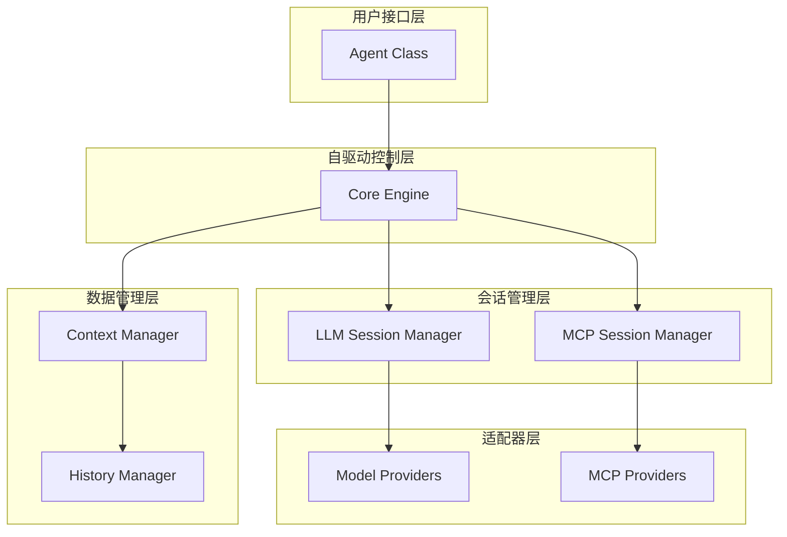
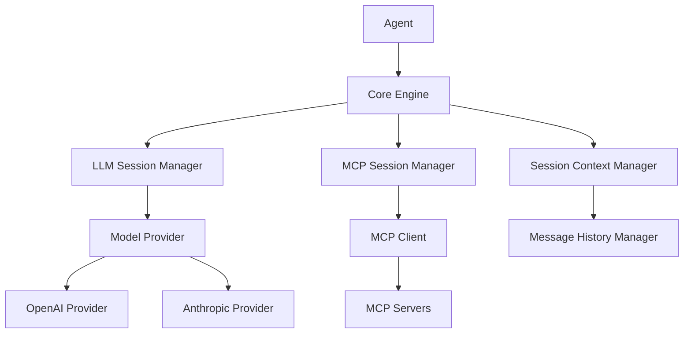
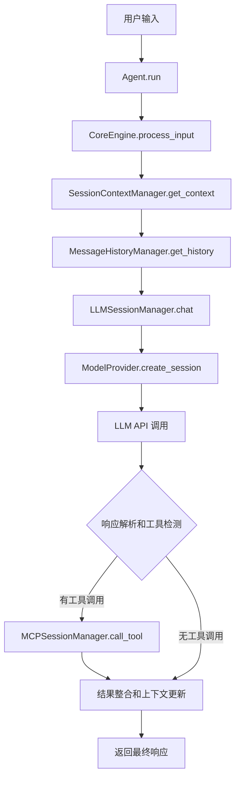
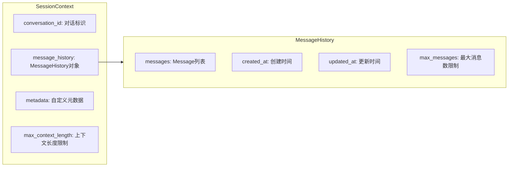

# Agent 智能体框架架构设计

## 架构概述

Agent 框架采用自驱动架构设计，通过模块化组件实现智能体的自主决策和执行能力。整个架构基于依赖注入和接口抽象，确保组件间的松耦合和高可扩展性。

## 设计原则

### 1. 自驱动理念
- **自主循环**：智能体具备自我驱动的能力，能够根据LLM响应自动决定下一步行动
- **工具感知**：自动检测和执行LLM响应中的工具调用
- **迭代收敛**：通过有限迭代次数确保执行收敛

### 2. 模块化设计
- **单一职责**：每个模块专注于特定的功能领域
- **接口抽象**：使用抽象基类定义清晰的接口契约
- **依赖注入**：支持自定义实现的替换和扩展

### 3. 生命周期管理
- **会话管理**：专业的连接生命周期管理
- **资源清理**：确保资源的正确释放
- **状态追踪**：实时监控组件状态

## 核心架构

### 1. 分层架构



### 2. 组件关系图



## 核心组件详解

### 1. Core Engine（自驱动核心）

**职责**：
- 协调所有组件的交互
- 实现自驱动决策循环
- 管理工具调用的检测和执行
- 控制迭代次数和收敛逻辑

**关键方法**：
```python
async def process_input(
    user_input: str, 
    conversation_id: str, 
    max_iterations: int | None = None
) -> str
```

**自驱动流程**：
1. 接收用户输入
2. 获取当前上下文
3. 调用LLM生成响应
4. 解析响应中的工具调用
5. 执行工具调用（如有）
6. 更新上下文
7. 重复3-6直到无工具调用或达到最大迭代次数

### 2. LLM Session Manager（大模型会话管理）

**职责**：
- 管理与大模型的会话生命周期
- 统一不同模型提供商的接口
- 处理连接失败和重试逻辑

**设计模式**：
- **策略模式**：通过ModelProvider抽象不同的模型实现
- **工厂模式**：ModelProviderFactory负责创建提供商实例

### 3. MCP Session Manager（MCP会话管理）

**职责**：
- 管理多个MCP服务器的连接
- 提供工具发现和调用能力
- 处理服务器健康状态监控

**特性**：
- **多服务器支持**：同时连接多个MCP服务器
- **命名空间隔离**：通过服务器名称前缀避免工具名冲突
- **自动重连**：检测连接失败并自动重连

### 4. Session Context Manager（会话上下文管理）

**职责**：
- 管理当前会话的状态信息
- 协调消息历史管理器
- 实现智能上下文截断

**核心功能**：
- **上下文截断**：当消息过多时智能保留重要信息
- **元数据管理**：支持自定义会话元数据
- **状态持久化**：与历史管理器协同实现状态持久化

### 5. Message History Manager（消息历史管理）

**职责**：
- 提供消息的持久化存储
- 支持内存和文件两种存储方式
- 实现消息的检索和管理

**存储策略**：
- **内存存储**：适合临时会话和快速原型
- **文件存储**：支持长期对话历史保存

### 6. Model Provider（模型提供商）

**职责**：
- 抽象不同大模型提供商的差异
- 统一工具调用格式
- 处理提供商特定的认证和配置

**支持的提供商**：
- **OpenAI**：支持GPT系列模型
- **Anthropic**：支持Claude系列模型
- **可扩展**：通过注册机制支持自定义提供商

## 数据流设计

### 1. 用户输入处理流程



### 2. 会话状态管理



## 错误处理和容错设计

### 1. 分层错误处理

- **Agent层**：捕获所有异常，提供用户友好的错误信息
- **CoreEngine层**：处理业务逻辑异常，实现重试机制
- **Session层**：处理连接异常，实现自动重连
- **Provider层**：处理API异常，提供降级策略

### 2. 容错机制

- **连接重试**：MCP和LLM连接失败时自动重试
- **工具调用失败处理**：单个工具失败不影响整体流程
- **上下文截断**：避免上下文过长导致的API调用失败
- **资源清理**：确保异常情况下的资源正确释放

## 扩展点设计

### 1. 自定义模型提供商

```python
class CustomModelProvider(ModelProvider):
    async def create_session(self) -> LLMSessionInterface:
        return CustomLLMSession(self.config)
    
    def get_provider_name(self) -> str:
        return "custom"

# 注册自定义提供商
ModelProviderFactory.register_provider("custom", CustomModelProvider)
```

### 2. 自定义存储后端

```python
class DatabaseMessageHistoryManager(MessageHistoryManagerInterface):
    async def create_history(self, conversation_id: str) -> MessageHistory:
        # 数据库实现
        pass
    
    async def save_history(self, history: MessageHistory) -> None:
        # 数据库保存
        pass
```

### 3. 自定义MCP客户端

```python
class CustomMCPClient(MCPClientInterface):
    async def call_tool(self, tool_name: str, arguments: dict) -> dict:
        # 自定义工具调用逻辑
        pass
```

## 性能优化设计

### 1. 异步编程

- **全异步架构**：所有I/O操作使用async/await
- **并发处理**：支持多个工具并行调用（未来版本）
- **连接池**：复用连接减少建立开销

### 2. 内存管理

- **消息限制**：自动限制历史消息数量
- **上下文截断**：智能截断过长的上下文
- **资源释放**：及时释放不需要的资源

### 3. 缓存策略

- **会话缓存**：缓存活跃的会话上下文
- **工具列表缓存**：缓存MCP服务器的工具列表
- **配置缓存**：缓存频繁访问的配置信息

## 安全性设计

### 1. API密钥管理

- **环境变量**：推荐使用环境变量存储API密钥
- **配置隔离**：将敏感配置与代码分离
- **密钥轮换**：支持动态更新API密钥

### 2. 输入验证

- **参数验证**：使用Pydantic进行严格的参数验证
- **长度限制**：限制输入消息的长度
- **格式检查**：验证配置格式的正确性

### 3. 日志安全

- **敏感信息过滤**：自动过滤日志中的敏感信息
- **日志级别控制**：生产环境使用适当的日志级别
- **审计追踪**：记录关键操作的审计日志

## 测试策略

### 1. 单元测试

- **组件隔离**：每个组件独立测试
- **Mock依赖**：使用Mock对象模拟外部依赖
- **边界条件**：测试各种边界和异常情况

### 2. 集成测试

- **组件协作**：测试组件间的交互
- **端到端**：完整的用户场景测试
- **性能测试**：验证系统性能指标

### 3. 测试工具

- **pytest**：使用pytest框架进行测试
- **asyncio测试**：支持异步代码测试
- **覆盖率统计**：确保足够的代码覆盖率

## 监控和运维

### 1. 健康检查

```python
# 系统健康状态检查
status = await agent.get_status()
{
    "name": "agent_name",
    "conversation_id": "conv_123",
    "engine": {
        "initialized": True,
        "llm_session": {"initialized": True},
        "mcp_sessions": {
            "filesystem": {"connected": True},
            "git": {"connected": False}
        }
    }
}
```

### 2. 指标监控

- **响应时间**：监控API调用响应时间
- **成功率**：跟踪工具调用成功率
- **资源使用**：监控内存和CPU使用情况
- **连接状态**：实时监控各种连接状态

### 3. 日志记录

- **结构化日志**：使用JSON格式的结构化日志
- **上下文信息**：记录请求ID和会话ID
- **性能指标**：记录关键操作的耗时

## 未来发展规划

### 短期目标（1-3个月）

1. **流式响应**：支持LLM的流式输出
2. **并行工具调用**：支持多个工具并行执行
3. **更多模型提供商**：集成Google Gemini、Cohere等
4. **性能优化**：优化内存使用和响应速度

### 中期目标（3-6个月）

1. **插件系统**：支持第三方插件扩展
2. **分布式部署**：支持多实例分布式部署
3. **Web界面**：提供Web管理界面
4. **API服务器**：提供REST API服务

### 长期目标（6-12个月）

1. **多模态支持**：支持图像、音频等多模态输入
2. **智能路由**：根据任务类型智能选择模型
3. **自动优化**：基于使用模式自动优化配置
4. **企业级特性**：支持多租户、权限管理等企业级功能

## 总结

Agent框架通过自驱动架构和模块化设计，提供了一个可扩展、可维护的智能体开发平台。其核心优势包括：

1. **简单易用**：提供简洁的API接口，隐藏复杂的内部实现
2. **高度可扩展**：支持自定义组件和第三方扩展
3. **生产就绪**：完善的错误处理、日志记录和监控机制
4. **性能优异**：异步架构和智能缓存提供优秀的性能表现

这种架构设计不仅满足了当前的需求，也为未来的扩展和优化奠定了坚实的基础。