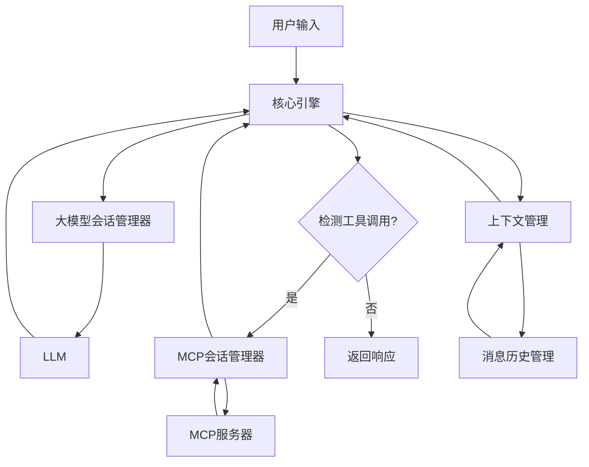

# Agentic 智能体框架

一个基于自驱动架构的 Python 智能体框架，支持与大型语言模型和 MCP（模型上下文协议）服务器的无缝集成。

## 特性

- **自驱动架构**：基于核心引擎的自主决策和执行循环
- **模块化设计**：清晰分离的组件，支持依赖注入和自定义实现
- **多模型支持**：内置支持 OpenAI 和 Anthropic 模型
- **MCP 服务器集成**：同时连接和管理多个 MCP 服务器
- **会话管理**：专业的会话生命周期管理
- **历史记录**：支持内存和文件的消息历史管理
- **上下文管理**：智能的对话上下文管理和截断

## 安装使用

### 作为内部包使用

```python
# 直接从项目内部引用
from src.agentic import Agent, AgentSettings, LLMSettings
```

### 环境要求
- Python 3.10+
- 所需依赖：
  - `openai` (如果使用 OpenAI)
  - `anthropic` (如果使用 Anthropic)
  - `mcp>=1.0.0`
  - `pydantic>=2.0.0`

## 快速开始

### 基本使用

```python
import asyncio
from agentic import Agent, AgentSettings, LLMSettings

async def main():
    # 配置智能体
    settings = AgentSettings(
        name="my_agent",
        instruction="你是一个有用的助手。",
        llm_settings=LLMSettings(
            provider="openai",  # 或 "anthropic"
            api_key="your-api-key",
            model="gpt-4"
        )
    )
    
    # 使用智能体
    async with Agent(settings).connect() as agent:
        response = await agent.run("你好，请介绍一下你自己")
        print(response)

asyncio.run(main())
```

### 使用MCP服务器

```python
import asyncio
from agentic import Agent, AgentSettings, LLMSettings, MCPServerSettings

async def main():
    settings = AgentSettings(
        name="tool_agent",
        instruction="你可以访问文件系统和其他工具。",
        llm_settings=LLMSettings(
            provider="anthropic",
            api_key="your-anthropic-key",
            model="claude-3-opus-20240229"
        ),
        mcp_servers={
            "filesystem": MCPServerSettings(
                name="filesystem",
                command="npx",
                args=["-y", "@modelcontextprotocol/server-filesystem", "/tmp"]
            ),
            "git": MCPServerSettings(
                name="git",
                command="npx",
                args=["-y", "@modelcontextprotocol/server-git", "--repository", "."]
            )
        }
    )
    
    async with Agent(settings).connect() as agent:
        response = await agent.run("请查看当前目录的文件，并检查Git状态")
        print(response)

asyncio.run(main())
```

### 使用持久化存储

```python
import asyncio
from agentic import Agent, AgentSettings, LLMSettings

async def main():
    settings = AgentSettings(
        name="persistent_agent",
        instruction="你是一个具有记忆的助手。",
        llm_settings=LLMSettings(
            provider="openai",
            api_key="your-api-key",
            model="gpt-4"
        )
    )
    
    # 指定存储目录用于持久化
    async with Agent(settings, storage_dir="./conversations").connect() as agent:
        # 第一次对话
        response = await agent.run("请记住我喜欢咖啡")
        print(response)
        
        # 切换对话ID（可选）
        agent.set_conversation_id("user_456")
        
        # 在同一会话中继续对话
        response = await agent.run("我之前说我喜欢什么？")
        print(response)

asyncio.run(main())
```

## API 参考

### Agent 类

主要的智能体类，提供简单的输入输出接口。

```python
class Agent:
    def __init__(
        self,
        settings: AgentSettings | dict[str, Any],
        conversation_id: str | None = None,
        storage_dir: str | None = None,
    )
    
    async def initialize() -> None
    async def close() -> None
    async def connect()  # 上下文管理器
    async def run(user_input: str, max_iterations: int | None = None) -> str
    async def get_status() -> dict[str, Any]
    async def clear_history(keep_system: bool = True) -> None
    async def get_history() -> list[dict[str, str]]
    def set_conversation_id(conversation_id: str) -> None
    async def list_conversations() -> list[str]
```

### 设置类

```python
class AgentSettings:
    name: str = "agent"
    instruction: str = "你是一个有用的助手。"
    mcp_servers: dict[str, MCPServerSettings] = {}
    llm_settings: LLMSettings
    max_iterations: int = 10
    debug: bool = False
    
    def add_mcp_server(name: str, command: str, args: list[str] | None = None)

class LLMSettings:
    provider: str = "openai"  # "openai" 或 "anthropic"
    api_key: str
    model: str = "gpt-4"
    temperature: float = 0.7
    max_tokens: int = 2048

class MCPServerSettings:
    name: str
    command: str
    args: list[str] = []
    env: dict[str, str] = {}
```

## 工作原理



该框架采用自驱动架构，工作流程如下：

1. **用户输入**：用户向智能体提供查询
2. **上下文管理**：获取当前会话上下文和历史消息
3. **大模型调用**：通过大模型会话管理器调用LLM
4. **响应解析**：核心引擎解析LLM响应，检测工具调用
5. **工具执行**：如果检测到工具调用，通过MCP会话管理器执行
6. **结果整合**：将工具结果添加到上下文
7. **自驱动循环**：重复步骤3-6，直到无需更多工具调用或达到最大迭代次数
8. **最终响应**：返回最终的LLM响应给用户

## 自定义组件

框架支持自定义组件的依赖注入：

```python
from agentic import (
    Agent, AgentSettings, 
    ModelProvider, LLMSessionInterface,
    MessageHistoryManager
)

# 自定义模型提供商
class CustomModelProvider(ModelProvider):
    async def create_session(self) -> LLMSessionInterface:
        # 自定义实现
        pass
    
    def get_provider_name(self) -> str:
        return "custom"

# 注册自定义提供商
ModelProviderFactory.register_provider("custom", CustomModelProvider)

# 使用自定义存储
history_manager = MessageHistoryManager.create_file_manager("./custom_storage")
```

## 许可证

这是用于演示目的的示例代码。

## 变更日志

### v2.0.0
- 完全重构为自驱动架构
- 新增模块化组件设计
- 改进的会话和上下文管理
- 统一的Agent接口
- 更好的错误处理和日志记录